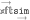

 

[](https://xftsim.readthedocs.io/en/latest/?badge=latest) [](https://badge.fury.io/py/xftsim)

# eXtensible Forward Time SIMulator
`xftsim` simulates complex phenotype/genotype data with an emphasis on short timescale phenomena. `xftsim` is designed with two primary goals:

 - make it easy for statistical geneticists to perform reproducible and systematic sensitivity analyses to better understand limitations and assumptions

 - enable evaulation of methods for analyzing complex traits under realistically complex generative models

## Installation

`xftsim` is on PyPI. It can be installed using pip:

```bash
pip install xftsim
```


## Getting started

To get started, [check out the documentation](https://xftsim.readthedocs.io)!

## Notice

`xftsim` is under active development. Stay tuned for tutorials and documentation in the near future!

<!-- 
## Quickstart: simulating bivariate cross-assortative mating

Here we simulate 


```python

import xftsim as xft
import numpy as np

N = 8000
M = 4000
pnames = ['height', 'wealth', 'eduyears']
h2 = np.array([.6,.0,.0])


founder_haplotypes = xft.founders.founder_haplotypes_uniform_AFs(n = N, 
                                                                 m = M)

genetic_effects = xft.effect.AdditiveEffects(beta = np.hstack(list(map(lambda x: np.random.normal(0, x, (M,1)), np.sqrt(h2)))),
                                             phenotype_name = pnames,
                                             vid = founder_haplotypes.vid,
                                             AF = founder_haplotypes.xft.af_empirical,
                                             standardized=True,
                                             scaled=True,
                                             m_causal=M)

arch_genetic = xft.arch.AdditiveGeneticComponent(beta = genetic_effects)
arch_noise = xft.arch.AdditiveNoiseComponent(variances=[.4, 1/3, 1/3], 
                                             phenotype_name=pnames)
arch_sum = xft.arch.SumComponent(pnames, sum_components=['additiveGenetic', 'additiveNoise'])


amr = xft.mate.LinearAssortativeMatingRegime(r = .3, 
                                             component_index = xft.index.ComponentIndex_from_product(pnames,
                                              ['phenotype'],
                                              [-1]),
                                             offspring_per_pair=xft.utils.ZeroTruncatedPoissonCount(2))

rmap = xft.reproduce.RecombinationMap(p=.25,
                                      vid=founder_haplotypes.vid,
                                      chrom=founder_haplotypes.chrom)

sim = xft.sim.Simulation(founder_haplotypes = founder_haplotypes,
                         mating_regime = amr,
                         recombination_map = rmap,
                         architecture=xft.arch.Architecture([arch_genetic, arch_noise, arch_sum]),
                         statistics = [xft.stats.MatingStatistics(),
                                       xft.stats.SampleStatistics(),
                                       xft.stats.HasemanElstonEstimator(),
                                       ],  
                         post_processors = [lambda sim: print(sim.results['mating_statistics']),
                                            xft.proc.LimitMemory(n_haplotype_generations=2)],
                         reproduction_method=xft.reproduce.Meiosis)

```


 -->
